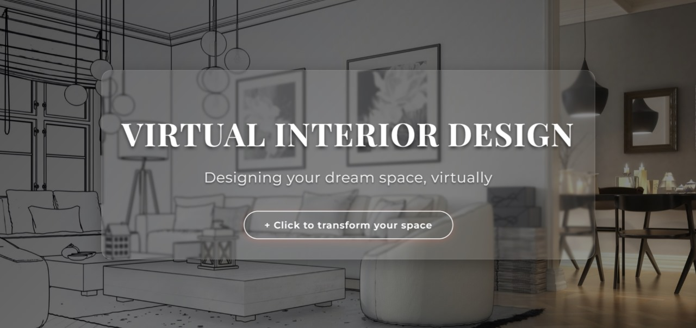
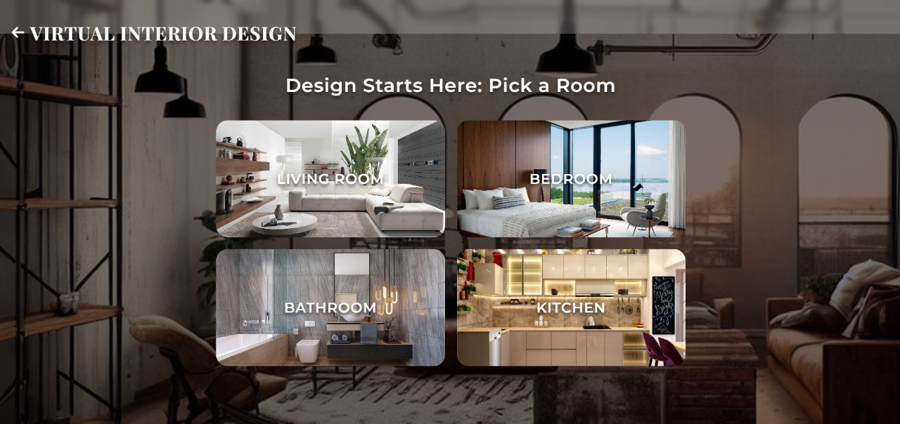
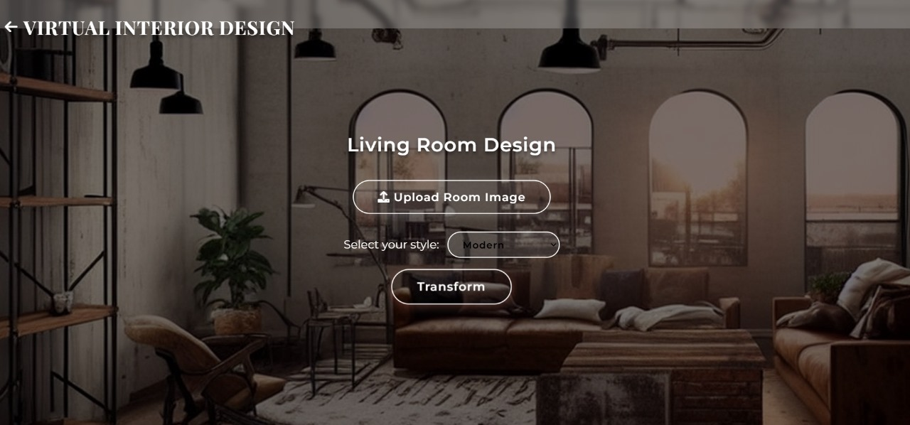
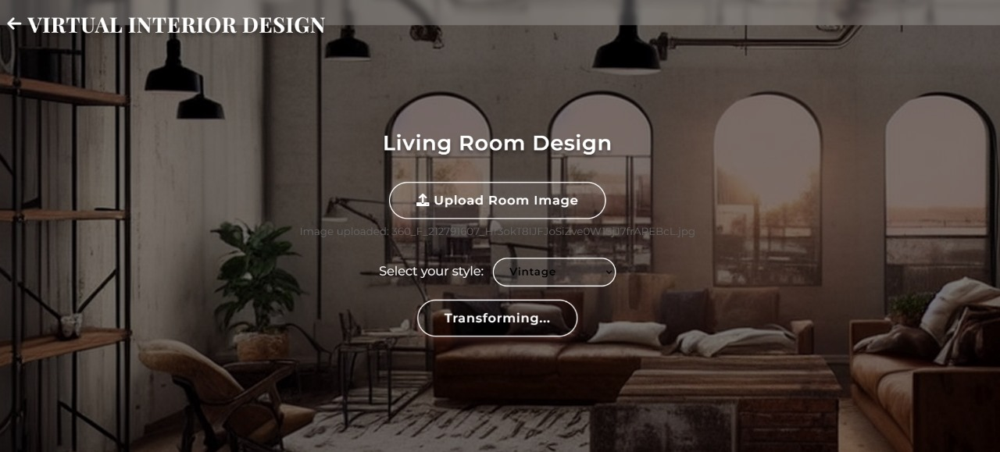
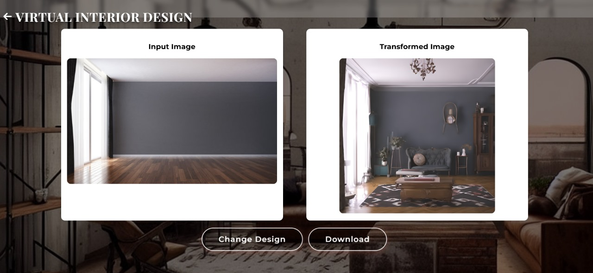
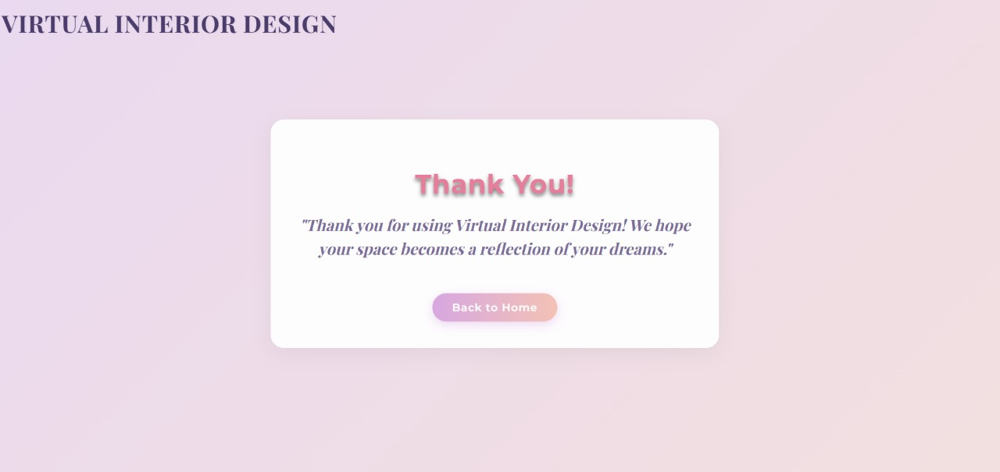

# Virtual Interior Designer
A web app to transform room images into different interior design styles using AI.

## System Requirements

This project is optimized to run on systems with GPU support due to the computational demands of the Stable Diffusion and Real-ESRGAN models. For optimal performance, a CUDA-compatible GPU with appropriate drivers is recommended. If you do not have access to a GPU or the necessary drivers installed locally, we recommend running the application on **Google Colab**, which provides free access to GPU resources in a cloud environment.If you are running on Google colab I suggest you to open "Copy_of_Virtual_Interior_Designer_with_GAN" file

## Features
- Upload a room image and choose a style ( Modern, Minimalist, Vintage, Rustic, Industrial, Bohemian, Scandinavian, Art_Deco).
- Transform rooms like living rooms, bedrooms, bathrooms, and kitchens.
- Download the transformed image . You can also change the generated design if you do not like the transformed image , it will regenerate
  
## How to Run
1. Clone this repo: `git clone https://github.com/vidyanunna/Virtual-Interior-Designer.git`
2. Install dependencies: `pip install -r requirements.txt` (or) Follow "Copy of Virtual Interior Designer with GAN" File
4. Run: `python app.py`

## Screenshots

